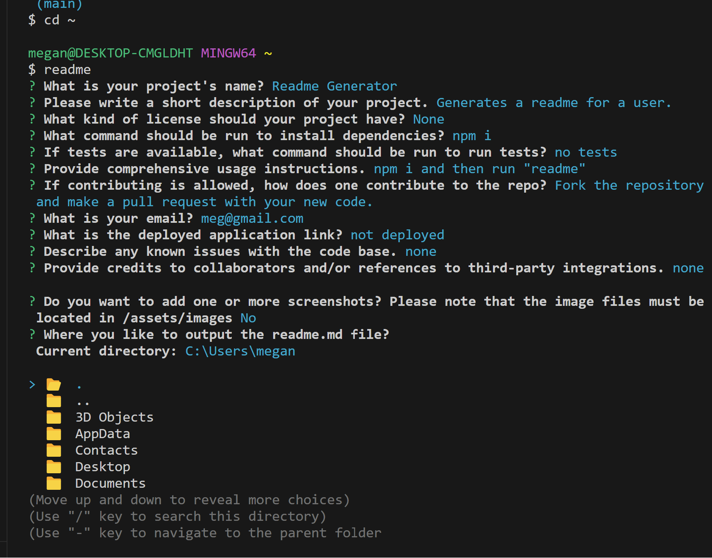

# README.md Generator 👨‍💻
  
  
  ## Description  ✏️
  
  This code will prompt the user on the usual readme sections and allow them to generate a readme.md for their project with emojis, TOC and proper formatting. Mulitple screenshots are supported. Screenshots must be located in the /assets/images folder of the project. 
  
  ## Table of Contents 📖
  
  - [Installation](#installation-🛠️)
  
  - [Usage](#usage-📝)

  

  - [Issues](#known-issues)

  - [Contributing](#how-to-contribute-🤝)
  
  - [Tests](#tests-🧪) 

  - [Credits](#credits)
  
  - [Questions](#questions-❓)
  
  ## Installation 🛠️
  
  To install necessary dependencies, run the following command:
  
  ```
  npm i
  ```
  
  ## Usage 📝
  
  This project will eventually be packaged as an executable, but for now, clone the repo, run "npm i" to install dependencies, and run "node index" from the command line.

  ### Deployed Link
  Not deployed

### Screenshots



## Known Issues
Currently there is no way to update the path to the screenshots. Currently for the readme to show the screenshots correctly, they must be located in the assets/images directory. 

## How To Contribute 🤝
  
Fork the repository and make a pull request with your new code.
  
## Tests 🧪
  
To run tests, run the following command:
  
  ```
  No tests at this time.
  ```


## Credits
None

 ## Questions ❓
  
If you have any questions about the repo, open an issue or contact me directly at megan.meyers.388@gmail.com. 
  
  