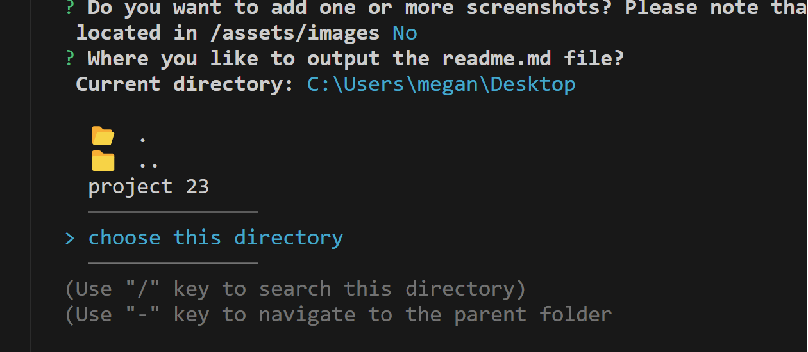

# README.md Generator 

## Description ✏️

This code will prompt the user on the usual readme sections and allow them to generate a readme.md for their project with emojis, TOC and proper formatting. Mulitple screenshots are supported. Screenshots must be located in the /assets/images folder of the project while assuming the README.md will be output or manually moved to the root of the readme's project directory. Output for the README.md is chosen using inquirer-select-directory and can be placed anywhere on the user's machine.

Now with support for adding tech badges. 

This README.md was created using this program, and therefore I have my screenshots in the /assets/images folder.

You can update this generator as you like to make it work better for you! My personal email is listed as the default for the email question and you will change that and make it yours. 

## Table of Contents 📖

- [Installation](#Installation)

- [Usage](#usage)

* [Issues](#known-issues)

* [Contributing](#how-to-contribute)

* [Tests](#tests)

* [Credits](#credits)

* [Questions](#questions)

## Installation

To install necessary dependencies, run the following command:

```
npm i
```

## Usag

After you clone the repo and install using "npm i" you will be able to run this CLI using the command

```
readme
```

from any directory. You will be asked for the output directory. It starts at the level you are currently running the 'readme' command from assuming you would have your terminal open to your project's root directory and also want your README in the root. You may navigate up and down as you like if you need to, however.

### Deployed Link

Not deployed - CLI only.

### Screenshots





## Known Issues

Currently there are only two directories to choose from for where the images are located in your app.
'assets/images'  or 
'src/assets/images'  

There is no validation on input yet!

## How To Contribute

Fork the repository and make a pull request with your new code.

## Tests

To run tests, run the following command:

```
No tests at this time.
```

## Credits

This project uses two npm packages:

[inquirer](https://www.npmjs.com/package/inquirer)

[inquirer-select-directory](https://classic.yarnpkg.com/en/package/inquirer-select-directory)


## Questions

If you have any questions about the repo or notice any bugs you want to report, open an issue or contact me directly at megan.meyers.388@gmail.com.
